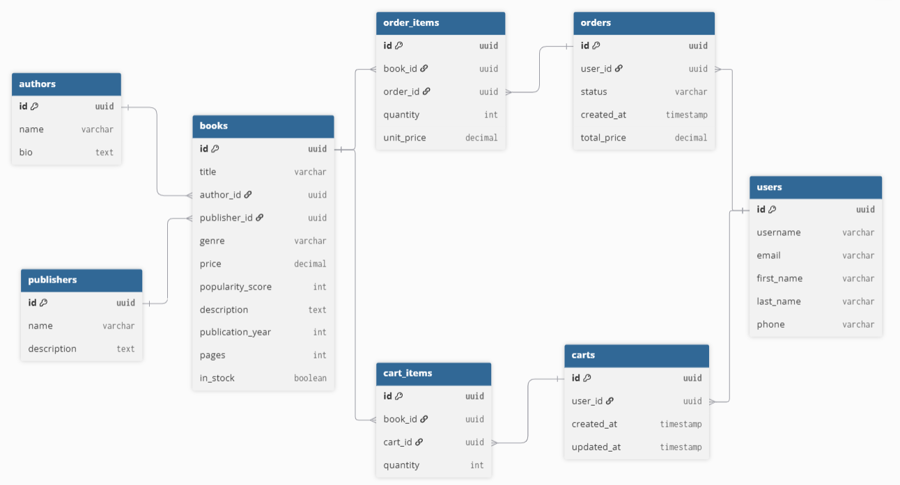

# 📚 Bookstore API

## 📝 Description
The **Bookstore API** is a RESTful backend service for managing a digital bookstore.

It provides a structured data model and endpoints to handle three core domains:
1. **Catalog Management**: Creating, retrieving, and filtering books, authors, and publishers.
2. **User Accounts**: Registering customers, secure authentication, and profile management.
3. **Sales Operations**: Managing digital shopping carts and processing order checkouts.

---

## 🚀 API Endpoints

### 📖 Books

| Endpoint       | Method     | Use                       | Request Params/Body                                                                                                                      | Status                                       | Response Body         |
|----------------|------------|---------------------------|------------------------------------------------------------------------------------------------------------------------------------------|----------------------------------------------|-----------------------|
| `/books/`      | **GET**    | List all books            | **Params**: `search` (title, author), `publisher`, `genre`, `ordering` (price, popularity, genre)                                        | `200 OK`                                     | Array of Book objects |
| `/books/`      | **POST**   | Create a new book         | **Body**: `{ title, author_id, publisher_id, genre, price, popularity_score, description, publication_year, pages, in_stock }`           | `201 Created`, `400 Bad Request`             | Created Book object   |
| `/books/{id}/` | **GET**    | Get specific book details | None                                                                                                                                     | `200 OK`, `404 Not Found`                    | Detailed Book object  |
| `/books/{id}/` | **PATCH**  | Update book data          | **Body**: `{ title?, author_id?, publisher_id?, genre?, price?, popularity_score?, description?, publication_year?, pages?, in_stock? }` | `200 OK`, `400 Bad Request`, `404 Not Found` | Updated Book object   |
| `/books/{id}/` | **DELETE** | Delete a book             | None                                                                                                                                     | `204 No Content`, `404 Not Found`            | None                  |

### ✍️ Authors

| Endpoint         | Method     | Use                      | Request Params/Body         | Status                                       | Response Body                           |
|------------------|------------|--------------------------|-----------------------------|----------------------------------------------|-----------------------------------------|
| `/authors/`      | **GET**    | List all authors         | None                        | `200 OK`                                     | Array of Author objects                 |
| `/authors/`      | **POST**   | Create a new author      | **Body**: `{ name, bio }`   | `201 Created`, `400 Bad Request`             | Created Author object                   |
| `/authors/{id}/` | **GET**    | Get author & their books | None                        | `200 OK`, `404 Not Found`                    | Author object (includes array of Books) |
| `/authors/{id}/` | **PATCH**  | Update author data       | **Body**: `{ name?, bio? }` | `200 OK`, `400 Bad Request`, `404 Not Found` | Updated Author object                   |
| `/authors/{id}/` | **DELETE** | Delete an author         | None                        | `204 No Content`, `404 Not Found`            | None                                    |

### 🏢 Publishers

| Endpoint            | Method     | Use                         | Request Params/Body                 | Status                                       | Response Body                              |
|---------------------|------------|-----------------------------|-------------------------------------|----------------------------------------------|--------------------------------------------|
| `/publishers/`      | **GET**    | List all publishers         | None                                | `200 OK`                                     | Array of Publisher objects                 |
| `/publishers/`      | **POST**   | Create new publisher        | **Body**: `{ name, description }`   | `201 Created`, `400 Bad Request`             | Created Publisher object                   |
| `/publishers/{id}/` | **GET**    | Get publisher & their books | None                                | `200 OK`, `404 Not Found`                    | Publisher object (includes array of Books) |
| `/publishers/{id}/` | **PATCH**  | Update publisher data       | **Body**: `{ name?, description? }` | `200 OK`, `400 Bad Request`, `404 Not Found` | Updated Publisher object                   |
| `/publishers/{id}/` | **DELETE** | Delete a publisher          | None                                | `204 No Content`, `404 Not Found`            | None                                       |

### 🔐 Authentication

| Endpoint                   | Method   | Use                  | Request Params/Body                                                                        | Status                                           | Response Body           |
|----------------------------|----------|----------------------|--------------------------------------------------------------------------------------------|--------------------------------------------------|-------------------------|
| `/accounts/register/`      | **POST** | Register a new user  | **Body**: `{ email, password, password_check, username, first_name?, last_name?, phone? }` | `201 Created`, `400 Bad Request`, `409 Conflict` | User object (No tokens) |
| `/accounts/login/`         | **POST** | Authenticate user    | **Body**: `{ username, password }`                                                         | `200 OK`, `401 Unauthorized`                     | `{ refresh, access }`   |
| `/accounts/login/refresh/` | **POST** | Refresh access token | **Body**: `{ refresh }`                                                                    | `200 OK`, `401 Unauthorized`                     | `{ access }`            |

### 👤 User Profile

| Endpoint           | Method    | Use                 | Request Params/Body                                                | Status                                               | Response Body          |
|--------------------|-----------|---------------------|--------------------------------------------------------------------|------------------------------------------------------|------------------------|
| `/me/`             | **GET**   | Get user profile    | None                                                               | `200 OK`, `401 Unauthorized`                         | User Profile object    |
| `/me/`             | **PATCH** | Update user profile | **Body**: `{ email?, password?, first_name?, last_name?, phone? }` | `200 OK`, `400 Bad Request`, `401 Unauthorized`      | Updated Profile object |
| `/me/orders/`      | **GET**   | Get order history   | None                                                               | `200 OK`, `401 Unauthorized`                         | Array of Order objects |
| `/me/orders/{id}/` | **GET**   | Get order details   | None                                                               | `200 OK`, `401 Unauthorized`, `404 Not Found`        | Detailed Order object  |
| `/me/orders/`      | **POST**  | Checkout / Buy cart | None                                                               | `201 Created`, `400 Bad Request`, `401 Unauthorized` | Created Order object   |

### 🛒 Cart

| Endpoint                    | Method     | Use                   | Request Params/Body               | Status                                                                | Response Body           |
|-----------------------------|------------|-----------------------|-----------------------------------|-----------------------------------------------------------------------|-------------------------|
| `/me/cart/`                 | **GET**    | Get current cart      | None                              | `200 OK`, `401 Unauthorized`                                          | Cart object (items)     |
| `/me/cart/`                 | **DELETE** | Clear entire cart     | None                              | `204 No Content`, `401 Unauthorized`                                  | None                    |
| `/me/cart/items/`           | **POST**   | Add item to cart      | **Body**: `{ book_id, quantity }` | `201 Created`, `400 Bad Request`, `401 Unauthorized`, `404 Not Found` | Created CartItem object |
| `/me/cart/items/{book_id}/` | **PATCH**  | Update item quantity  | **Body**: `{ quantity }`          | `200 OK`, `400 Bad Request`, `401 Unauthorized`, `404 Not Found`      | Updated CartItem object |
| `/me/cart/items/{book_id}/` | **DELETE** | Remove item from cart | None                              | `204 No Content`, `401 Unauthorized`, `404 Not Found`                 | None                    |

---

## Implementation Summary

The backend currently focuses on the catalog management and user authentication features. The following components have been fully implemented:

* **Models & Database**: 
  * Defined models for `Author`, `Publisher`, and `Book`, along with foundational models for `User`, `Cart`, `CartItem`, `Order`, and `OrderItem`.
* **Serializers**: 
  * Implemented distinct serializers for the catalog and foundational sales models (`Book`, `Author`, `Publisher`, `User`, `Cart`, `Order`).
  * Detail serializers for Authors and Publishers include nested data of their associated books.
  * Serializers for Carts and Orders also implement nested arrays of their respective items.
  * Implemented strict serializers for User registration and profile updates with custom validation (e.g., secure passwords, phone length checks, unique emails).
* **API Views & Routing**: 
  * Created list and detail CRUD endpoints for Books, Authors, and Publishers.
  * Configured URL routing for all active catalog endpoints.
  * Added JWT-based authentication endpoints (`/accounts/login/`, `/accounts/login/refresh/`).
  * Added secure user registration (`/accounts/register/`) and a `/me/` endpoint to view and update profiles.
  * Implemented Cart management endpoints (`/me/cart/`, `/me/cart/items/`) to add, update, and remove cart items.
  * Implemented Order history and checkout endpoints (`/me/orders/`) with safe transactional processing.
* **Authentication & Permissions**:
  * Configured `djangorestframework-simplejwt` for robust, stateless token-based auth.
  * Catalog endpoints use custom `IsAdminUserOrReadOnly` permissions to allow public viewing but restrict editing to staff.
  * The profile endpoint is secured via `IsAuthenticated` preventing IDOR attacks.
* **Logging**:
  * Implemented structured logging across all views using Python's `logging` module to track successful actions (fetches, creates) and warnings (validation failures, constraint conflicts).
* **Query Capabilities**:
  * The books endpoint supports text search (`title`, `author name`), filtering (`publisher`, `genre`), and custom sorting (e.g., `popularity_score`, `price`).
* **Error Handling & Integrity**: 
  * Enforced protected foreign-key constraints gracefully: attempting to delete an Author or Publisher linked to a Book returns a `409 Conflict` with a JSON error message. 
  * Deleting a Book linked to an active cart or order returns a `409 Conflict`.
* **CORS & Frontend Integration**: 
  * Configured `django-cors-headers` to allow a separate frontend repository to successfully fetch data and demonstrate CORS requests.
* **Testing**: 
  * Included an updated `postman_collection.json` containing test requests for all implemented catalog and account endpoints.

---

## 🛠️ Startup Guide

You can run this project using either `uv` (recommended) or standard `pip`.

### Using `uv` (Recommended)

1. **Sync dependencies and create a virtual environment**:
   ```bash
   uv sync
   ```
2. **Apply migrations**:
   ```bash
   uv run python manage.py migrate
   ```
3. **Run the development server**:
   ```bash
   uv run python manage.py runserver
   ```

### Using `pip`

1. **Create and activate a virtual environment**:
   ```bash
   # Windows
   python -m venv .venv
   .venv\Scripts\activate
   
   # macOS/Linux
   python -m venv .venv
   source .venv/bin/activate
   ```
2. **Install dependencies**:
   ```bash
   pip install .
   ```
3. **Apply migrations**:
   ```bash
   python manage.py migrate
   ```
4. **Run the development server**:
   ```bash
   python manage.py runserver
   ```

---

## 🗄️ Database Schema


